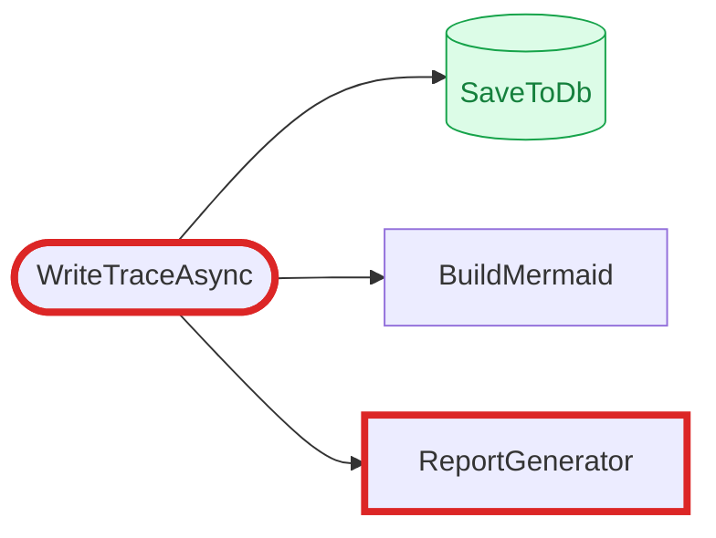

<!-- _class: title -->

# CodeIntel

## Local AI Code Intelligence

*Load any codebase. Get structured findings in minutes. Hand off to Copilot.*

---

## The Problem

Every developer has been here:

- **Unfamiliar codebase** — where does this flow actually go?
- **Buried business logic** — what are the real rules in this 800-line stored proc?
- **Change confidence** — what breaks if I touch this method?
- **Code review** — is there something wrong here that I'm missing?

Existing options are slow (read it all yourself), interruptive (ask a colleague), or context-blind (paste fragments into Copilot).

---

## The Architecture

> The local model is a **briefing officer**.  
> GitHub Copilot (your team subscription) is the **analyst**.

```
Your Repo (.sln / .sql)
      │
      ▼
 Local LLM  ──► <finding> blocks + Mermaid diagram + complexity table
 (in-process,        │
  no cloud)          │   Markdown report committed into your repo
                     ▼
             #file: → Copilot Chat → Jira tickets / fix plans / PRs
```

The MD report is a **durable, human-readable, AI-consumable** artifact — not a chat transcript.

---

## Three Modes

| Mode | Engine | What you get |
|---|---|---|
| **Analysis** | LLM agentic loop | Findings: bugs, dead code, business rules |
| **Trace** | Roslyn BFS + LLM | Call graph with node synopses + Mermaid |
| **Metrics** | Roslyn / ANTLR static | Complexity table — no inference, instant |

Each mode ends with **Save to Repo** → a preset-aware Copilot prompt you paste into Copilot Chat.

---

<!-- _class: section-header -->

# Analysis Mode

*Agentic finding loop across selected files*

---

<!-- _class: demo -->

## Analysis Mode — How It Works

**8 presets**, filtered by language (C# or PL/SQL):

<span class="chip">find-bugs</span><span class="chip">find-dead-code</span><span class="chip">find-business-rules</span><span class="chip">summarize</span>  
<span class="chip chip-purple">find-bugs-sql</span><span class="chip chip-purple">find-business-rules-sql</span><span class="chip chip-purple">cleanup-stored-proc</span><span class="chip chip-purple">efficiency-review</span>

**Agentic loop** (up to 3 iterations):
1. LLM reads context → emits `<finding>` blocks *and* `<request_context>` requests
2. Server fulfills via **Roslyn** — class bodies, method signatures, callers, callees
3. Findings carry **confidence** (`high` / `low`) — low ones surface dimmed, never dropped

---

<!-- _class: demo -->

## Analysis Mode — Demo

<!-- To embed a recording: replace the div below with:
     <video src="./videos/analysis-demo.mp4" controls></video>
     Record with Win+G (Xbox Game Bar) or OBS -->

<div class="video-box">
  📹 DEMO — or paste video here<br><br>
  <small>
    Show: load CodeIntel.sln → select a file → pick "find-bugs" → hit Run<br>
    Watch tokens stream in, findings appear with confidence chips<br>
    Click a finding → VS Code deep-link opens the exact line
  </small>
</div>

---

<!-- _class: demo -->

## Analysis — Findings Output

Each finding has: **severity** · **file + line** · **title** · **explanation** · **confidence**

- High-confidence findings get a solid indigo left bar
- Low-confidence findings are **dimmed** with a dashed bar and a tooltip
- Ignore button stores a SHA-256 signature — suppressed on future runs

After the loop: **FindingsAggregator** collapses near-duplicates across iterations.  
If any duplicate was `high`, the group promotes to `high`.

---

<!-- _class: demo -->

## Analysis → Copilot Handoff

Hit **Save to repo** → file lands in `docs/codeintel/`:

```markdown
## Copilot Next Step
You are a senior C# engineer reviewing these findings.
For each HIGH confidence finding, produce a Jira ticket:
- Title: one sentence
- Severity: Critical / High / Medium
- Reproduction steps: ...
- Suggested fix: ...
```

Paste `#file:docs/codeintel/2026-05-13-find-bugs-a3f2.md` into Copilot Chat.  
Instant structured triage.

---

<!-- _class: section-header -->

# Trace Mode

*BFS call graph — callers, callees, or both*

---

<!-- _class: demo -->

## Trace Mode — How It Works

Type a method name (or click **"Trace from here"** in any file preview):

- **Direction**: Callers / Callees / Both
- **Depth**: 1–5 levels

**Server does:**
- Roslyn `SymbolFinder.FindCallersAsync` (memoized per run) for callers
- Semantic model walk of `InvocationExpressionSyntax` for callees
- Node classification: `Normal` · `DbAccess` (cylinder) · `HttpCall` (hexagon)
- LLM generates a 1–2 sentence synopsis per node

Mermaid diagram is **generated programmatically** — not LLM-emitted, always correct.

---

<!-- _class: demo -->

## Trace Mode — Demo

<div class="video-box">
  📹 DEMO — Trace from any symbol<br><br>
  <small>
    <strong>Cool moment:</strong> open any file → click a method name → "Trace from `methodName`"<br>
    Switches to Trace mode pre-populated with the symbol's location (Roslyn-resolved)<br>
    Watch the Mermaid diagram build live · DB nodes are cylinders · HTTP nodes are hexagons<br>
    Click a node card → VS Code opens at the method definition
  </small>
</div>

---

<!-- _class: demo -->

## ★ The killer feature — Findings overlay on trace

Run an Analysis. Switch to Trace. **The bug findings auto-decorate the call graph.**

- Bug rings appear on Mermaid nodes where findings landed
- Each node card gets a finding chip (`BUG`, `WARN`, `DEAD`) with severity color
- Click the dismiss chip to hide the overlay



The trace becomes a **bug heatmap** — instantly see which paths in the call graph have known issues.

---

<!-- _class: section-header -->

# More Cool UX

*Pin to analysis · click-to-trace · code annotation view*

---

<!-- _class: demo -->

## Pin to Analysis

Select a line range in any file → **"Pin to analysis"** button → snippet becomes a chip.

Switch to free-text mode and ask a focused question:

> *"Why does this loop have a 90-second timeout instead of using the request token?"*

The pinned snippet is sent verbatim with your question — model has the exact context.

---

<!-- _class: demo -->

## Code Annotation View

After a Find Bugs / Find Dead Code / Business Rules run:

- **Output tab** — streamed model rationale + finding cards (default)
- **Code tab** — toggle in the header → see findings rendered **inline** in the source

Each finding sits next to the line it flagged, color-coded by severity, expandable for full context.

---

<!-- _class: section-header -->

# Metrics Tab

*Static complexity — no inference, always instant*

---

<!-- _class: demo -->

## Metrics Tab — Demo

<!-- <video src="./videos/metrics-demo.mp4" controls></video> -->

<div class="video-box">
  📹 DEMO — or paste video here<br><br>
  <small>
    Show: switch to Metrics tab → compute → sortable table loads<br>
    Sort by cyclomatic complexity → flag chips appear on high values<br>
    Click a row → file opens at the method's start line in the preview panel
  </small>
</div>

---

<!-- _class: demo -->

## Metrics Tab — What It Measures

| Metric | C# (Roslyn) | PL/SQL (ANTLR) |
|---|---|---|
| Cyclomatic complexity | ✅ | ✅ |
| Nesting depth | ✅ | — |
| Method length | ✅ | — |
| Parameter count | ✅ | — |
| Empty-catch blocks | ✅ | — |
| Sync-over-async | ✅ | — |
| Cursor declarations | — | ✅ |
| Swallowed WHEN OTHERS | — | ✅ |

Results **cached by content hash** — instant on reopen. Re-runs only when files change.

---

<!-- _class: section-header -->

# What Shipped to Make It a Team Tool

*Not just "demo on my laptop"*

---

## Hardening Pass

<div style="display:grid;grid-template-columns:1fr 1fr;gap:1.5em">

<div>

**Reliability**
- Per-analysis CTS triad: user cancel · idle watchdog (90s) · hard ceiling (600s)
- Partial findings survive cancel
- `/healthz` + `/readyz` probes for OpenShift

**Performance**
- Result cache (SHA-256 content key, 7-day TTL)
- Workspace LRU cap (3 loaded solutions)
- O(n) single-pass finding parser

</div>
<div>

**Safety**
- Rate limiting — 5 runs/min per IP, 429 body
- Secret scrubbing (AWS, GitHub PAT, JWT, PEM) before MD write
- PathSafety — containment check, can't write outside workspace

**UX**
- Ignored findings — per-workspace FP suppression
- Findings diff — added / resolved / persisted
- VS Code deep-link from every finding card

</div>
</div>

---

## What I Learned

**"Don't make the local model good — make Copilot's verification round fast."**  
A 7B model is noisy. Structured output + confidence fields + aggregation beats prompt engineering.

**ANTLR beats regex for real grammars.**  
The regex PL/SQL parser mishandled comments, strings, multi-line statements. Narrow grammar, correct output.

**Machine-specific config drift is a real outage.**  
Lost half a day to committing CUDA settings to main. Lesson: `appsettings.Development.json` (gitignored) + `git update-index --skip-worktree`.

**SQLite is underrated for dev tools.**  
WAL mode, zero ops, OpenShift PVC-mountable. Right call over Postgres.

---

## What's Next

**Before OpenShift:**
- **Auth** — Windows Auth via IIS passthrough; `WorkspaceController.Browse` still leaks the host filesystem today
- **Configurable CORS** — hardcoded `5173/5174` → `appsettings.json`

**Feature expansion:**
- **Oracle live** — `ALL_TABLES` / `USER_SOURCE` instead of repo-only DDL grep
- **TypeScript LSP** — LSP client shipped; needs verification on a real React/Next.js repo
- **Business documentation mode** — trace all entry points → feature catalog
- **Dockerfile + OpenShift** — multi-stage build, volume mounts, `/readyz` probe

---

<!-- _class: title -->

# Thank You

**Try it:** `dotnet run` — model loads on startup (~30s), status dot goes green when ready

*Local LLM · Roslyn · ANTLR · SignalR · React 19 · SQLite*

---

<!--
════════════════════════════════════════════════════════════════════
  SPEAKER NOTES  (not rendered as slides)
════════════════════════════════════════════════════════════════════

PACING — 10 minutes total

Slide 1 — Title (0:00–0:30)
  "I built a tool during dev days that lets you point a local LLM
   at any codebase — C# solutions, PL/SQL stored procs — and get
   structured findings, call graphs, and complexity metrics in
   minutes, without sending your code anywhere."

Slide 2 — Problem (0:30–1:30)
  "The trigger: I kept getting handed unfamiliar code to review.
   No fast way to get oriented. Read everything slowly, interrupt
   a colleague, or paste fragments into Copilot without full context."

Slide 3 — Architecture (1:30–2:30)
  "The key insight was separating the roles. A 7B model on my
   laptop is good at reading 500 lines and saying 'three things
   look suspicious.' It's bad at being authoritative. Copilot —
   with our team's existing subscription — is great at taking a
   structured briefing and producing tickets, PRs, fix plans.
   The MD report is the bridge. Durable, committable, AI-consumable."

Slide 4 — Three Modes (2:30–3:00)
  Quick overview. "Three modes: analysis is the LLM loop, trace is
   Roslyn BFS for call graphs, metrics is static analysis — no
   inference, always instant."

── ANALYSIS SECTION ────────────────────────────────────────────

Slide 5 — Section header (3:00–3:10)  [just read the title]

Slide 6 — Analysis How It Works (3:10–3:45)
  "Eight presets filtered by language. The agentic loop: the model
   can request more context mid-run — a class body, a method, its
   callers — and the server fulfills via Roslyn. Every finding
   carries a confidence field. Low-confidence ones surface dimmed
   but are never dropped — a hedged real finding beats a missed one."

Slide 7 — Analysis Demo (3:45–5:00)  [LIVE DEMO or VIDEO]
  Load CodeIntel.sln → select a file → find-bugs → Run
  Watch tokens stream in, findings appear
  Click a finding to open VS Code at the exact line

Slide 8 — Findings Output (5:00–5:30)
  "After the loop, a dedup pass collapses near-duplicates the 7B
   model tends to re-state across iterations. Ignore button
   persists a SHA-256 signature — suppressed on future runs."

Slide 9 — Copilot Handoff (5:30–6:00)
  "Save to repo → file lands in docs/codeintel/. The report ends
   with a preset-aware Copilot prompt. Paste the #file: reference
   into Copilot Chat and get instant structured triage."

── TRACE SECTION ───────────────────────────────────────────────

Slide 10 — Section header (6:00–6:05)

Slide 11 — Trace How It Works (6:05–6:30)
  "Type a method name — or click Trace from here in any file
   preview. Pick direction and depth. Roslyn does a BFS; the
   diagram is generated programmatically, not by the LLM, so it's
   always correct. DB access nodes are cylinders, HTTP call nodes
   are hexagons."

Slide 12 — Trace Demo (6:30–7:15)  [LIVE DEMO or VIDEO]
  Type ReportWriter.WriteTraceAsync → Callees → depth 1 → Run
  Show Mermaid diagram building live
  Click a node to open VS Code

Slide 13 — Trace Output (7:15–7:30)
  Point out shapes, colors, dashed back-edges. Quick.

── METRICS SECTION ─────────────────────────────────────────────

Slide 14 — Section header (7:30–7:35)

Slide 15 — Metrics Demo (7:35–8:00)  [LIVE DEMO or VIDEO]
  Switch to Metrics tab → Compute → sort by complexity → click a row

Slide 16 — Metrics What It Measures (8:00–8:15)
  "No inference. Roslyn AST walk for C#, ANTLR token stream for
   PL/SQL. Cached by content hash — re-opening on an unchanged
   workspace is instant."

── HARDENING + WRAP ────────────────────────────────────────────

Slide 17 — Hardening (8:15–8:50)
  "This crossed from demo to team-tool territory. Rate limiting,
   secret scrubbing, result cache, health probes. The main blocker
   before OpenShift is auth."

Slide 18 — What I Learned (8:50–9:20)
  Hit the 4 bullets quickly. The 7B model insight is the most
  interesting one — spend a sentence on it.

Slide 19 — What's Next (9:20–9:45)
  Auth is the gate. Everything else is feature expansion.

Slide 20 — Thank You / Questions (9:45–10:00)


════════════════════════════════════════════════════════════════════
  VIDEO RECORDING GUIDE
════════════════════════════════════════════════════════════════════

  Recommended: record each feature as a separate short clip,
  then embed in the matching demo slide.

  RECORDING TOOLS (Windows, free):
  ──────────────────────────────────
  • Xbox Game Bar     Win + G → Record  (built-in, no install)
  • OBS Studio        obsproject.com     (more control, free)
  • ShareX            getsharex.com      (also exports GIF)

  EMBEDDING IN MARP:
  ──────────────────────────────────
  1. Save clips to  docs/videos/  alongside this file.
  2. Replace the <div class="video-box"> block with:

     <video src="./videos/analysis-demo.mp4" controls></video>

  3. In VS Code Marp settings, enable "allowLocalFiles" so
     the preview can load local video files:
     { "markdown.marp.allowLocalFiles": true }

  4. Export to HTML (not PDF) so <video> stays interactive.
     Marp CLI: marp PRESENTATION.md --html -o presentation.html

  CLIP GUIDE:
  ──────────────────────────────────
  analysis-demo.mp4   ~60s   Load .sln, select files, run find-bugs,
                             watch stream, click finding → VS Code
  trace-demo.mp4      ~45s   Type method, run callees depth=1,
                             Mermaid renders, click node → VS Code
  metrics-demo.mp4    ~30s   Switch to Metrics, compute, sort,
                             click row → file preview at method line

════════════════════════════════════════════════════════════════════
-->
