# Call-Trail Trace

**Generated:** 2026-05-12 20:44:49 UTC  
**Entry point:** `CodeIntel.Server.Services.ReportWriter.WriteTraceAsync(CodeIntel.Server.Models.TraceResult, CodeIntel.Server.Models.Workspace, string?, System.Threading.CancellationToken)`  
**Direction:** Both  
**Depth:** 2  
**Nodes:** 20 · **Edges:** 29  
**Duration:** 187.1s

## Call graph

```mermaid
flowchart TD
  n0["ReportWriter.WriteTraceAsync"]
  n1["TraceController.Save"]
  n2["IReportGenerator.GenerateTraceMarkdown"]
  n3["IReportWriter.WriteTraceAsync"]
  n4["ITraceResultStore.Get"]
  n5["ITraceResultStore.Save"]
  n6["IWorkspaceService.GetWorkspace"]
  n7["new ReportWriteResult"]
  n8["ReportWriter.BuildTraceFilename"]
  n9["ReportWriter.EnsureFolderReadme"]
  n10["new IndexEntry"]
  n11["ReportWriter.LoadIndexAsync"]
  n12["ReportWriter.NormalizeRelativeFolder"]
  n13["ReportWriter.ResolveWorkspaceRoot"]
  n14["ReportWriter.SaveIndexJsonAsync"]
  n15["ReportWriter.SaveIndexMdAsync"]
  n16["ReportWriter.ShortenSymbolFqn"]
  n17["ReportWriter.Slugify"]
  n18["ReportWriter.UpdateIndexForTraceAsync"]
  n19["ReportWriter.WriteAsync"]
  n1 --> n0
  n0 --> n13
  n0 --> n12
  n0 --> n9
  n0 --> n8
  n0 --> n2
  n0 --> n18
  n0 --> n7
  n1 --> n4
  n1 --> n6
  n1 --> n3
  n1 --> n5
  n19 --> n13
  n0 --> n13
  n19 --> n12
  n0 --> n12
  n19 --> n9
  n0 --> n9
  n0 --> n8
  n8 --> n16
  n8 --> n17
  n0 --> n2
  n0 --> n18
  n18 --> n11
  n18 --> n10
  n18 --> n14
  n18 --> n15
  n19 --> n7
  n0 --> n7
  style n0 fill:#7c3aed,stroke:#4f46e5,color:#fff
```



## Node synopses

### ReportWriter.WriteTraceAsync
**Location:** `C:\Users\heidn\Repos\Devdays\CodeIntel\src\CodeIntel.Server\Services\ReportWriter.cs:90`  
**Symbol:** `CodeIntel.Server.Services.ReportWriter.WriteTraceAsync(CodeIntel.Server.Models.TraceResult, CodeIntel.Server.Models.Workspace, string?, System.Threading.CancellationToken)`

This method writes a trace report asynchronously to a specified output directory within a workspace. It generates Markdown content from a `TraceResult`, saves it to a file, and optionally updates an index file.

### TraceController.Save
**Location:** `C:\Users\heidn\Repos\Devdays\CodeIntel\src\CodeIntel.Server\Controllers\TraceController.cs:63`  
**Symbol:** `CodeIntel.Server.Controllers.TraceController.Save(System.Guid, CodeIntel.Server.Controllers.TraceController.SaveTraceRequest?, System.Threading.CancellationToken)`

This method handles a POST request to save a trace report. It retrieves the trace by ID, checks if the workspace is still loaded, writes the trace report asynchronously, updates the trace with the new report path, saves the updated trace, and logs the save operation. It returns the trace ID, absolute path, relative path, and a Copilot reference.

### IReportGenerator.GenerateTraceMarkdown
**Location:** `C:\Users\heidn\Repos\Devdays\CodeIntel\src\CodeIntel.Server\Services\ReportGenerator.cs:9`  
**Symbol:** `CodeIntel.Server.Services.IReportGenerator.GenerateTraceMarkdown(CodeIntel.Server.Models.TraceResult, string?)`

This method generates a Markdown formatted string representing a trace report based on the provided `TraceResult` object. If a `referenceFilename` is provided, it includes a reference to that file in the generated Markdown.

### IReportWriter.WriteTraceAsync
**Location:** `C:\Users\heidn\Repos\Devdays\CodeIntel\src\CodeIntel.Server\Services\ReportWriter.cs:14`  
**Symbol:** `CodeIntel.Server.Services.IReportWriter.WriteTraceAsync(CodeIntel.Server.Models.TraceResult, CodeIntel.Server.Models.Workspace, string?, System.Threading.CancellationToken)`

This method asynchronously writes a trace result to a report, using the specified workspace and optionally overriding the output path. It returns a `ReportWriteResult` object, which indicates the success or failure of the operation.

### ITraceResultStore.Get
**Location:** `C:\Users\heidn\Repos\Devdays\CodeIntel\src\CodeIntel.Server\Services\TraceResultStore.cs:9`  
**Symbol:** `CodeIntel.Server.Services.ITraceResultStore.Get(System.Guid)`

This method retrieves a `TraceResult` object from the store using a specified `Guid` identifier.

### ITraceResultStore.Save
**Location:** `C:\Users\heidn\Repos\Devdays\CodeIntel\src\CodeIntel.Server\Services\TraceResultStore.cs:8`  
**Symbol:** `CodeIntel.Server.Services.ITraceResultStore.Save(CodeIntel.Server.Models.TraceResult)`

This method saves a `TraceResult` object to a storage location.

### IWorkspaceService.GetWorkspace
**Location:** `C:\Users\heidn\Repos\Devdays\CodeIntel\src\CodeIntel.Server\Services\RoslynWorkspaceService.cs:14`  
**Symbol:** `CodeIntel.Server.Services.IWorkspaceService.GetWorkspace(string)`

This method retrieves a workspace by its unique identifier from the workspace service.

### new ReportWriteResult
**Location:** `C:\Users\heidn\Repos\Devdays\CodeIntel\src\CodeIntel.Server\Services\ReportWriter.cs:9`  
**Symbol:** `CodeIntel.Server.Services.ReportWriteResult.ReportWriteResult(string, string)`

This method defines a record type named `ReportWriteResult` with two properties: `AbsolutePath` and `RelativePath`.

### ReportWriter.BuildTraceFilename
**Location:** `C:\Users\heidn\Repos\Devdays\CodeIntel\src\CodeIntel.Server\Services\ReportWriter.cs:137`  
**Symbol:** `CodeIntel.Server.Services.ReportWriter.BuildTraceFilename(CodeIntel.Server.Models.TraceResult)`

This method constructs a filename for a trace report based on the `TraceResult` object. It uses the completion date, shortened symbol fully qualified name, direction, and a truncated ID to generate a unique filename in the format `yyyy-MM-dd-trace-dir-label-id.md`.

### ReportWriter.EnsureFolderReadme
**Location:** `C:\Users\heidn\Repos\Devdays\CodeIntel\src\CodeIntel.Server\Services\ReportWriter.cs:232`  
**Symbol:** `CodeIntel.Server.Services.ReportWriter.EnsureFolderReadme(string)`

This method checks if a `README.md` file exists in the specified output directory. If it does not exist, it creates the file and writes a predefined content template to it, which includes information about the code analysis reports and their purpose.

### new IndexEntry
**Location:** `C:\Users\heidn\Repos\Devdays\CodeIntel\src\CodeIntel.Server\Services\ReportWriter.cs:362`  
**Symbol:** `CodeIntel.Server.Services.ReportWriter.IndexEntry.IndexEntry(string, System.DateTime, string, string?, string?, string?, System.Collections.Generic.List<string>?, int?, int?, string?, string?, int?, int?, bool?, double)`

This method defines a record type named `IndexEntry` with properties to store details about a report, including the filename, completion time, type of report, and various specific fields for analysis and trace reports.

### ReportWriter.LoadIndexAsync
**Location:** `C:\Users\heidn\Repos\Devdays\CodeIntel\src\CodeIntel.Server\Services\ReportWriter.cs:289`  
**Symbol:** `CodeIntel.Server.Services.ReportWriter.LoadIndexAsync(string, System.Threading.CancellationToken)`

This method asynchronously loads a list of `IndexEntry` objects from a specified file path. If the file does not exist or an error occurs during deserialization (such as a JSON exception or I/O exception), it returns an empty list.

### ReportWriter.NormalizeRelativeFolder
**Location:** `C:\Users\heidn\Repos\Devdays\CodeIntel\src\CodeIntel.Server\Services\ReportWriter.cs:198`  
**Symbol:** `CodeIntel.Server.Services.ReportWriter.NormalizeRelativeFolder(string?)`

This method trims and normalizes a relative folder path by removing any leading or trailing whitespace, replacing backslashes with forward slashes, and returning null if the result is empty or null.

### ReportWriter.ResolveWorkspaceRoot
**Location:** `C:\Users\heidn\Repos\Devdays\CodeIntel\src\CodeIntel.Server\Services\ReportWriter.cs:205`  
**Symbol:** `CodeIntel.Server.Services.ReportWriter.ResolveWorkspaceRoot(CodeIntel.Server.Models.Workspace)`

This method checks if the project path of the given workspace exists as a file. If it does, it returns the directory containing the project file; otherwise, it returns the project path as is.

### ReportWriter.SaveIndexJsonAsync
**Location:** `C:\Users\heidn\Repos\Devdays\CodeIntel\src\CodeIntel.Server\Services\ReportWriter.cs:305`  
**Symbol:** `CodeIntel.Server.Services.ReportWriter.SaveIndexJsonAsync(string, System.Collections.Generic.List<CodeIntel.Server.Services.ReportWriter.IndexEntry>, System.Threading.CancellationToken)`

This method asynchronously saves a list of `IndexEntry` objects to a JSON file at the specified `path`. It uses `JsonSerializer.SerializeAsync` to serialize the list into JSON format and writes it to the file using a `FileStream`.

### ReportWriter.SaveIndexMdAsync
**Location:** `C:\Users\heidn\Repos\Devdays\CodeIntel\src\CodeIntel.Server\Services\ReportWriter.cs:311`  
**Symbol:** `CodeIntel.Server.Services.ReportWriter.SaveIndexMdAsync(string, System.Collections.Generic.List<CodeIntel.Server.Services.ReportWriter.IndexEntry>, System.Threading.CancellationToken)`

This method asynchronously saves an Markdown report to a specified file path. It constructs a report containing a table of index entries, each with details such as date, type, subject, result, and a link to the report file.

### ReportWriter.ShortenSymbolFqn
**Location:** `C:\Users\heidn\Repos\Devdays\CodeIntel\src\CodeIntel.Server\Services\ReportWriter.cs:151`  
**Symbol:** `CodeIntel.Server.Services.ReportWriter.ShortenSymbolFqn(string)`

This method shortens a fully qualified name (FQN) obtained from Roslyn's `ToDisplayString` method by removing the parameter list and keeping only the last two name segments.

### ReportWriter.Slugify
**Location:** `C:\Users\heidn\Repos\Devdays\CodeIntel\src\CodeIntel.Server\Services\ReportWriter.cs:220`  
**Symbol:** `CodeIntel.Server.Services.ReportWriter.Slugify(string)`

This method takes a string input, converts it to lowercase, and replaces non-alphanumeric characters with hyphens. It trims any leading or trailing hyphens and returns the resulting slug. If the resulting slug is empty, it returns "report" instead.

### ReportWriter.UpdateIndexForTraceAsync
**Location:** `C:\Users\heidn\Repos\Devdays\CodeIntel\src\CodeIntel.Server\Services\ReportWriter.cs:162`  
**Symbol:** `CodeIntel.Server.Services.ReportWriter.UpdateIndexForTraceAsync(string, string, CodeIntel.Server.Models.TraceResult, System.Threading.CancellationToken)`

This method updates an index file for a code trace by removing any existing entry for the specified filename and adding a new entry with the trace result details. It then saves the updated index in JSON and Markdown formats.

### ReportWriter.WriteAsync
**Location:** `C:\Users\heidn\Repos\Devdays\CodeIntel\src\CodeIntel.Server\Services\ReportWriter.cs:42`  
**Symbol:** `CodeIntel.Server.Services.ReportWriter.WriteAsync(CodeIntel.Server.Models.AnalysisResult, CodeIntel.Server.Models.Workspace, string?, System.Threading.CancellationToken)`

This method asynchronously writes an analysis report to a specified output path within a workspace. It first resolves the workspace root, normalizes the output path, and ensures the output directory is within the workspace. If successful, it generates Markdown content for the report, writes it to a file, and updates an index if configured. If any step fails, it logs the error and returns null.

---

## Copilot Next Step

The call graph above shows both what invokes `CodeIntel.Server.Services.ReportWriter.WriteTraceAsync(CodeIntel.Server.Models.TraceResult, CodeIntel.Server.Models.Workspace, string?, System.Threading.CancellationToken)` and what it
calls internally. Ask Copilot:

```text
Using the bidirectional call graph and per-node synopses above, write a focused
change-impact analysis: if I modify the behavior of CancellationToken),
which callers are affected, and which downstream operations might break?
```

Reference this file in Copilot Chat:

```text
#file:2026-05-12-trace-both-reportwriterwritetraceasync-21f06a7f.md
```

