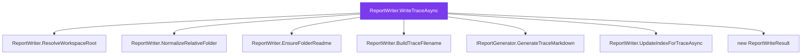

# Call-Trail Trace

**Generated:** 2026-05-12 20:20:52 UTC  
**Entry point:** `CodeIntel.Server.Services.ReportWriter.WriteTraceAsync(CodeIntel.Server.Models.TraceResult, CodeIntel.Server.Models.Workspace, string?, System.Threading.CancellationToken)`  
**Direction:** Callees  
**Depth:** 1  
**Nodes:** 8 · **Edges:** 7  
**Duration:** 85.5s

## Call graph



## Node synopses

### ReportWriter.WriteTraceAsync
**Location:** `c:\Users\heidn\Repos\Devdays\CodeIntel\src\CodeIntel.Server\Services\ReportWriter.cs:90`  
**Symbol:** `CodeIntel.Server.Services.ReportWriter.WriteTraceAsync(CodeIntel.Server.Models.TraceResult, CodeIntel.Server.Models.Workspace, string?, System.Threading.CancellationToken)`

This method asynchronously writes a trace report to a specified output directory within a workspace. It first resolves the workspace root, normalizes the output path, and ensures the output directory is within the workspace. If successful, it generates trace markdown, writes it to a file, and updates an index if configured. If any step fails, it logs the error and returns null.

### IReportGenerator.GenerateTraceMarkdown
**Location:** `c:\Users\heidn\Repos\Devdays\CodeIntel\src\CodeIntel.Server\Services\ReportGenerator.cs:9`  
**Symbol:** `CodeIntel.Server.Services.IReportGenerator.GenerateTraceMarkdown(CodeIntel.Server.Models.TraceResult, string?)`

This method generates a Markdown report from a `TraceResult` object, optionally using a reference filename for comparison.

### new ReportWriteResult
**Location:** `c:\Users\heidn\Repos\Devdays\CodeIntel\src\CodeIntel.Server\Services\ReportWriter.cs:9`  
**Symbol:** `CodeIntel.Server.Services.ReportWriteResult.ReportWriteResult(string, string)`

This method defines a record type named `ReportWriteResult` with two properties: `AbsolutePath` and `RelativePath`.

### ReportWriter.BuildTraceFilename
**Location:** `c:\Users\heidn\Repos\Devdays\CodeIntel\src\CodeIntel.Server\Services\ReportWriter.cs:137`  
**Symbol:** `CodeIntel.Server.Services.ReportWriter.BuildTraceFilename(CodeIntel.Server.Models.TraceResult)`

This method constructs a filename for a trace report based on the `TraceResult` object's properties, including the completion date, shortened symbol fully qualified name, direction, and a truncated ID.

### ReportWriter.EnsureFolderReadme
**Location:** `c:\Users\heidn\Repos\Devdays\CodeIntel\src\CodeIntel.Server\Services\ReportWriter.cs:232`  
**Symbol:** `CodeIntel.Server.Services.ReportWriter.EnsureFolderReadme(string)`

This method checks if a `README.md` file exists in the specified output directory. If it does not exist, it creates the file and writes a predefined content template to it, serving as documentation for auto-generated analysis reports.

### ReportWriter.NormalizeRelativeFolder
**Location:** `c:\Users\heidn\Repos\Devdays\CodeIntel\src\CodeIntel.Server\Services\ReportWriter.cs:198`  
**Symbol:** `CodeIntel.Server.Services.ReportWriter.NormalizeRelativeFolder(string?)`

This method normalizes a relative folder path by trimming any leading or trailing whitespace, replacing backslashes with forward slashes, and then trimming any remaining forward slashes. If the resulting string is empty or null, it returns null; otherwise, it returns the normalized folder path.

### ReportWriter.ResolveWorkspaceRoot
**Location:** `c:\Users\heidn\Repos\Devdays\CodeIntel\src\CodeIntel.Server\Services\ReportWriter.cs:205`  
**Symbol:** `CodeIntel.Server.Services.ReportWriter.ResolveWorkspaceRoot(CodeIntel.Server.Models.Workspace)`

This method checks if the project path of a given workspace exists. If it does, it returns the directory containing the project path; otherwise, it returns the project path itself.

### ReportWriter.UpdateIndexForTraceAsync
**Location:** `c:\Users\heidn\Repos\Devdays\CodeIntel\src\CodeIntel.Server\Services\ReportWriter.cs:162`  
**Symbol:** `CodeIntel.Server.Services.ReportWriter.UpdateIndexForTraceAsync(string, string, CodeIntel.Server.Models.TraceResult, System.Threading.CancellationToken)`

This method updates an index file for a trace result by removing any existing entry for the specified filename and adding a new entry with the trace result details. It then saves the updated index in JSON and Markdown formats.

---

## Copilot Next Step

The call graph above shows what `CodeIntel.Server.Services.ReportWriter.WriteTraceAsync(CodeIntel.Server.Models.TraceResult, CodeIntel.Server.Models.Workspace, string?, System.Threading.CancellationToken)` does internally.
Ask Copilot:

```text
Using the call graph and per-node synopses above, produce a one-page developer-facing
overview of CancellationToken): what it does, what it touches
(DBs, files, external services), and any risks or surprises a new dev should know.
```

Reference this file in Copilot Chat:

```text
#file:2026-05-12-trace-callees-reportwriterwritetraceasync-12dfe80f.md
```

